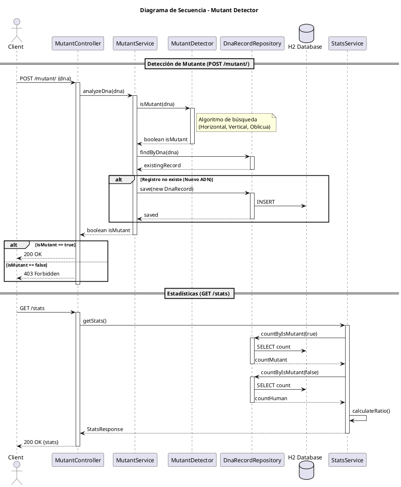

# Diagrama de Secuencia - Mutant Detector

```plantuml
@startuml
title Diagrama de Secuencia - Mutant Detector

actor Client
participant "MutantController" as Controller
participant "MutantService" as Service
participant "MutantDetector" as Detector
participant "DnaRecordRepository" as Repository
database "H2 Database" as DB

== Detección de Mutante (POST /mutant/) ==
Client -> Controller: POST /mutant/ {dna}
activate Controller

Controller -> Service: analyzeDna(dna)
activate Service

Service -> Detector: isMutant(dna)
activate Detector
note right of Detector: Algoritmo de búsqueda\n(Horizontal, Vertical, Oblicua)
Detector --> Service: boolean isMutant
deactivate Detector

Service -> Repository: findByDna(dna)
activate Repository
Repository --> Service: existingRecord
deactivate Repository

alt Registro no existe (Nuevo ADN)
    Service -> Repository: save(new DnaRecord)
    activate Repository
    Repository -> DB: INSERT
    Repository --> Service: saved
    deactivate Repository
end

Service --> Controller: boolean isMutant
deactivate Service

alt isMutant == true
    Controller --> Client: 200 OK
else isMutant == false
    Controller --> Client: 403 Forbidden
end
deactivate Controller

== Estadísticas (GET /stats) ==
Client -> Controller: GET /stats
activate Controller

Controller -> "StatsService" as Stats: getStats()
activate Stats

Stats -> Repository: countByIsMutant(true)
activate Repository
Repository -> DB: SELECT count
Repository --> Stats: countMutant
deactivate Repository

Stats -> Repository: countByIsMutant(false)
activate Repository
Repository -> DB: SELECT count
Repository --> Stats: countHuman
deactivate Repository

Stats -> Stats: calculateRatio()

Stats --> Controller: StatsResponse
deactivate Stats

Controller --> Client: 200 OK {stats}
deactivate Controller

@enduml
```
